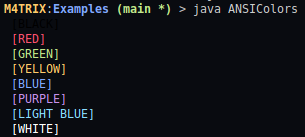

# TEXT USER INTERFACE EXAMPLES

### Colors in Java

ANSI CODE|COLOR|CODE EXAMPLE
|---|---|---|
`\033[30m`|Black|**System.out.println("\033[30m [BLACK]");**
`\033[31m`|Red|**System.out.println("\033[31m [RED]");**
`\033[32m`|Green|**System.out.println("\033[32m [GREEN]");**
`\033[33m`|Yellow|**System.out.println("\033[33m [YELLOW]");**
`\033[34m`|Blue|**System.out.println("\033[34m [BLUE]");**
`\033[35m`|Purple|**System.out.println("\033[35m [PURPLE]");**
`\033[36m`|Light Blue|**System.out.println("\033[36m [LIGHT BLUE]");**
`\033[37m`|White|**System.out.println("\033[37m [WHITE]");**

\033[32m Teste

