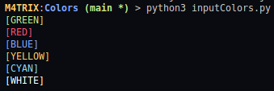
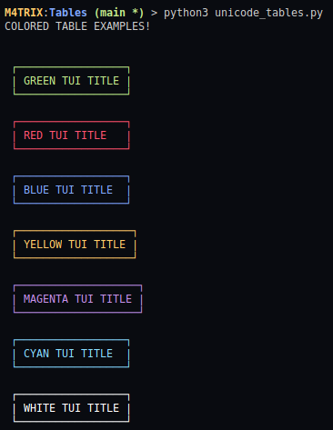

# TEXT USER INTERFACE EXAMPLES

### Colors in Java

ANSI CODE|COLOR|CODE EXAMPLE
|---|---|---|
`\033[30m`|Black|**System.out.println("\033[30m [BLACK]");**
`\033[31m`|Red|**System.out.println("\033[31m [RED]");**
`\033[32m`|Green|**System.out.println("\033[32m [GREEN]");**
`\033[33m`|Yellow|**System.out.println("\033[33m [YELLOW]");**
`\033[34m`|Blue|**System.out.println("\033[34m [BLUE]");**
`\033[35m`|Purple|**System.out.println("\033[35m [PURPLE]");**
`\033[36m`|Light Blue|**System.out.println("\033[36m [LIGHT BLUE]");**
`\033[37m`|White|**System.out.println("\033[37m [WHITE]");**


### DIFFS Colors

* Used in Markdown, put the symbol before write something

```diff
- Red text
+ Green Text
! text in orange
# Text in gray
@@ Text in Purple and Bold @@
```

### Colors in Javascript using Node.js

* When using Node.js, you can install the Module **cli-colors**
* Inside the Node.js project, write on Terminal:

```shell
> npm install cli-color
```
* Call the Module on your .js file:

```javascript
var colors = require("cli-color");
```
* Examples:

```javascript
var color = require('cli-color');

console.log(color.green("[GREEN]"));
console.log(color.red("[RED]"))
console.log(color.blue("[BLUE]"));
console.log(color.yellow("[YELLOW]"));
console.log(color.cyan("[CYAN]"));
console.log(color.magenta("[MAGENTA]"));
console.log(color.white("[WHITE]"));
```


### Colors in Python (colorama)

* Install Colorama package = `pip3 install colorama`
* Import Colorama Foreground and Style: 

```python
from colorama import Fore,Style
```

* Call the Colors like the Examples Below

```python
print(Fore.GREEN + '[GREEN]')
print(Fore.RED + '[RED]')
print(Fore.BLUE + '[BLUE]')
print(Fore.YELLOW + '[YELLOW]')
print(Fore.CYAN + '[CYAN]')
print(Fore.WHITE + '[WHITE]')
print(Style.RESET_ALL) # Reset the previous color
```




## TUI TITLES

* Titles using the Following unicode commands:

Example|Insert on VIM|Insert on VSCODE|Code
|---|---|---|---|
`┌` | <kbd>Ctrl</kbd> + <kbd>v</kbd> + <kbd>u</kbd>|<kbd>Ctrl</kbd> + <kbd>Shift</kbd> + <kbd>u</kbd>|250C
`┐` | <kbd>Ctrl</kbd> + <kbd>v</kbd> + <kbd>u</kbd>|<kbd>Ctrl</kbd> + <kbd>Shift</kbd> + <kbd>u</kbd>|2510
`└` | <kbd>Ctrl</kbd> + <kbd>v</kbd> + <kbd>u</kbd>|<kbd>Ctrl</kbd> + <kbd>Shift</kbd> + <kbd>u</kbd>| 2514
`┘` | <kbd>Ctrl</kbd> + <kbd>v</kbd> + <kbd>u</kbd>|<kbd>Ctrl</kbd> + <kbd>Shift</kbd> + <kbd>u</kbd>| 2518
`─` | <kbd>Ctrl</kbd> + <kbd>v</kbd> + <kbd>u</kbd>|<kbd>Ctrl</kbd> + <kbd>Shift</kbd> + <kbd>u</kbd>| 2500

* [|]() is used to close the box from each side of text!

* Simple example:

```text
┌───────────────────────────────────────────┐
| THIS IS THE TITLE FROM SOME INFORMATION   |
└───────────────────────────────────────────┘
```

* Using Colors: 



## TUI BOARDS

Simbolo|Código
|---|---|
╔ |2554
═ |2550
║ |2551
╗ |2557
╚ |255a
╝ |255d
╦ |2566
╠ |2560
╣ |2563
╩ |2569
╬ |256c


```
╔═══════════════════════════════╦════════════════════════════════╗
║    Nome                       ║   Felipe de Almeida            ║
╠═══════════════════════════════╬════════════════════════════════╣
║                               ║                                ║
```


